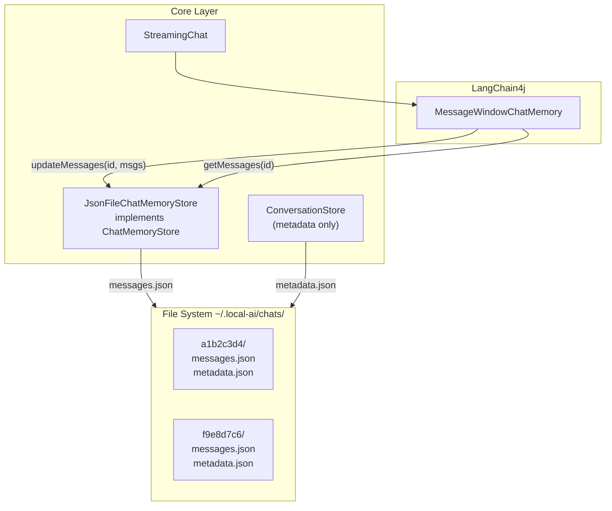
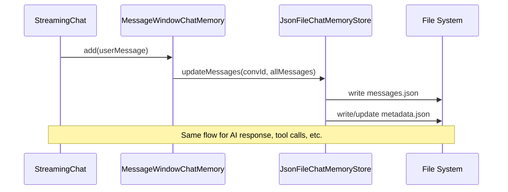

# Chat persistence in JSON files

## Architecture overview

LangChain4j's `ChatMemoryStore` interface is called automatically by `MessageWindowChatMemory` after every message addition. We implement it to persist messages to JSON files, eliminating the need for a custom auto-saver layer.




### File structure per conversation

```
~/.local-ai/chats/
  a1b2c3d4/
    messages.json      <-- LangChain4j ChatMessage list (serialized via ChatMessageSerializer)
    metadata.json      <-- our metadata (title, dates, forkedFrom)
  f9e8d7c6/
    messages.json
    metadata.json
```

Two files keep concerns separated:

- `messages.json` is owned by LangChain4j serialization (1:1 with LLM memory, faithful replay)
- `metadata.json` is our domain data (title, timestamps, fork info)

## Data model (core module)

### `ConversationMetadata` record in [core/.../storage/conversations/ConversationMetadata.java](core/src/main/java/dev/local/ai/core/storage/conversations/ConversationMetadata.java)

```java
@JsonIgnoreProperties(ignoreUnknown = true)
public record ConversationMetadata(
    String id,
    String title,
    Instant createdAt,
    Instant updatedAt,
    ForkInfo forkedFrom       // nullable, for future fork support
) {}
```

- `forkedFrom` included now (nullable) to avoid future schema migration
- `title` generated from first 60 chars of first user message

### `ForkInfo` record

```java
public record ForkInfo(String conversationId, int atMessageIndex) {}
```

### `ConversationSummary` record

```java
public record ConversationSummary(String id, String title, Instant createdAt, Instant updatedAt) {}
```

- Lightweight listing object derived from `ConversationMetadata`

## ChatMemoryStore implementation (core module)

### `JsonFileChatMemoryStore` in [core/.../storage/conversations/JsonFileChatMemoryStore.java](core/src/main/java/dev/local/ai/core/storage/conversations/JsonFileChatMemoryStore.java)

Implements `dev.langchain4j.store.memory.chat.ChatMemoryStore`:

- `**getMessages(Object memoryId)**`: read `chats/{memoryId}/messages.json`, deserialize using `ChatMessageDeserializer.messagesFromJson()`; return empty list if file doesn't exist
- `**updateMessages(Object memoryId, List<ChatMessage> messages)**`: serialize using `ChatMessageSerializer.messagesToJson()`, write to `chats/{memoryId}/messages.json`, create directory if needed. Also update `metadata.json` updatedAt timestamp (and create metadata with auto-generated title on first write)
- `**deleteMessages(Object memoryId)**`: delete `chats/{memoryId}/` directory

Key points:

- Uses LangChain4j's built-in `ChatMessageSerializer` / `ChatMessageDeserializer` for message JSON
- `MessageWindowChatMemory` calls `updateMessages` automatically after every `chatMemory.add()` -- no manual save logic needed
- Title auto-generated from first `UserMessage` content (first 60 chars)

### How auto-save works (no custom code needed)




## Metadata store (core module)

### `ConversationStore` in [core/.../storage/conversations/ConversationStore.java](core/src/main/java/dev/local/ai/core/storage/conversations/ConversationStore.java)

Manages conversation metadata (not messages). Responsibilities:

- `List<ConversationSummary> listConversations()` -- scan `chats/` subdirectories, read `metadata.json` from each, cache in memory, return sorted by `updatedAt` desc
- `Optional<ConversationSummary> getLastConversation()` -- most recently updated from cache
- `void deleteConversation(String id)` -- delete directory `chats/{id}/`, remove from cache
- `String createConversation()` -- create new directory with UUID, initial empty metadata, return ID
- `void refreshCache()` -- rescan directories (e.g. after external changes)

In-memory cache: `Map<String, ConversationSummary>` populated on construction.

Note: `JsonFileChatMemoryStore.updateMessages()` also updates metadata.json (updatedAt, title on first message), so `ConversationStore` needs to be notified or re-read metadata after saves. Simplest approach: `JsonFileChatMemoryStore` holds a reference to `ConversationStore` and calls `refreshSummary(id)` after writing metadata.

## Refactoring StreamingChat (core module)

### Changes to [core/.../chat/streaming/StreamingChat.java](core/src/main/java/dev/local/ai/core/chat/streaming/StreamingChat.java)

`ChatMemory` becomes a constructor parameter instead of being created internally:

```java
public StreamingChat(StreamingChatModel chatModel,
                     ChatMemory chatMemory,         // <-- injected
                     IToolProvider toolProvider,
                     CoreEventBus eventBus,
                     StreamingChatModelsProvider chatModelsProvider)
```

Remove the internal `MessageWindowChatMemory.builder()...build()` call from constructor.

This enables the caller (`ControllerFactory`) to build `ChatMemory` with the file-backed `ChatMemoryStore`, and also to set the `memoryId` to the conversation ID.

Same change for [core/.../chat/Chat.java](core/src/main/java/dev/local/ai/core/chat/Chat.java) if needed.

## Wiring (UI module)

### Changes to [ui/.../context/AppContext.java](ui/src/main/java/dev/local/ai/context/AppContext.java)

- Add `ConversationStore conversationStore` field
- Add `JsonFileChatMemoryStore chatMemoryStore` field
- Both instantiated in constructor with base path `~/.local-ai/chats/`

### Changes to [ui/.../context/ControllerFactory.java](ui/src/main/java/dev/local/ai/context/ControllerFactory.java)

Building `ChatController`:

1. Determine conversation ID: `conversationStore.getLastConversation().map(id)` or `conversationStore.createConversation()` for new
2. Build `ChatMemory`:

```java
   MessageWindowChatMemory.builder()
       .id(conversationId)
       .chatMemoryStore(chatMemoryStore)
       .maxMessages(1000)
       .build()
   

```

1. Build `StreamingChat(streamingModel, chatMemory, toolProvider, eventBus, modelsProvider)`
2. Build `ChatViewModel(chat, ...)` -- existing callback chain unchanged

### Startup flow

```
AppContext created
  -> ConversationStore scans chats/ (builds in-memory summaries)
  -> JsonFileChatMemoryStore created (same base directory)

ControllerFactory.call(ChatController.class)
  -> get last conversation ID from ConversationStore (or create new)
  -> build ChatMemory with chatMemoryStore and conversation ID
     -> MessageWindowChatMemory calls getMessages(conversationId)
     -> messages.json loaded automatically into memory
  -> build StreamingChat with injected ChatMemory
  -> build ChatViewModel
  -> chat.setCallback(chatViewModel) -- existing flow, no AutoSaver needed
  -> populate ChatViewModel.chatMessages from chatMemory.messages() for UI display
```

Key insight: `MessageWindowChatMemory` automatically loads messages from `ChatMemoryStore.getMessages()` on construction. The last conversation's messages are available immediately.

## Tests

- `**JsonFileChatMemoryStoreTest**` -- test `getMessages`, `updateMessages`, `deleteMessages` with `@TempDir`; verify messages.json and metadata.json are created/updated; verify title auto-generation from first UserMessage
- `**ConversationStoreTest**` -- test `listConversations`, `createConversation`, `deleteConversation`, `getLastConversation` with `@TempDir`
- Both using JUnit 5, Mockito BDD style where appropriate, `@Captor` for argument capture

## Opening and creating new conversations

### Architecture decision: one `StreamingChat` per conversation (multi-window-ready)

`MessageWindowChatMemory` binds its conversation `id` as `final` at construction, so a single `ChatMemory` instance cannot represent more than one conversation in its lifetime. Rather than fighting this with mutable setters or a `Supplier<ChatMemory>` indirection, we model **one `StreamingChat` = one conversation session**. Switching to another conversation means *closing* the current `StreamingChat` and *creating* a new one.

This is also the only model that scales to the future "conversation in a new window/tab" feature: each window/tab will own an independent `StreamingChat` while sharing the singletons (`ConversationStore`, `JsonFileChatMemoryStore`, connection/tool/model providers, `CoreEventBus`).

```mermaid
flowchart LR
    subgraph singletons [App-wide singletons]
        CS["ConversationStore"]
        JCMS["JsonFileChatMemoryStore"]
        TP["IToolProvider"]
        MP["StreamingChatModelsProvider"]
        EB["CoreEventBus"]
    end
    subgraph win1 [Window/Tab 1]
        VM1["ChatViewModel"]
        Sess1["ChatSession\nid=A"]
        SC1["StreamingChat"]
        CM1["MessageWindowChatMemory(id=A)"]
        VM1 --> Sess1
        Sess1 --> SC1
        Sess1 --> CM1
    end
    subgraph win2 [Window/Tab 2 (future)]
        VM2["ChatViewModel"]
        Sess2["ChatSession\nid=B"]
        SC2["StreamingChat"]
        CM2["MessageWindowChatMemory(id=B)"]
        VM2 --> Sess2
        Sess2 --> SC2
        Sess2 --> CM2
    end
    SC1 --> CM1
    SC2 --> CM2
    CM1 --> JCMS
    CM2 --> JCMS
    VM1 -. uses .-> CS
    VM2 -. uses .-> CS
    SC1 -. subscribes .-> EB
    SC2 -. subscribes .-> EB
```


Implications we accept now and design around:

- `StreamingChat` needs an explicit lifecycle (`close()`), because today it subscribes to `CoreEventBus` in its constructor without keeping the listener references, so a discarded instance would leak and keep reacting to `LLMChangedEvent`/`StopRequestEvent`.
- `ChatMemory`, `ChatSession` and `StreamingChat` carry no mutable conversation state outside themselves; switching is "drop the old, build a new."
- We do not introduce new global broadcast events for conversation lifecycle. The dialog and any future window observe `ConversationStore` directly via an `ObservableList` exposure (see milestone C).
- `LLMChangedEvent` and `StopRequestEvent` remain global for now. When multi-window arrives we will add a target-id field and have listeners filter on it; we deliberately avoid adding more broadcast event types in this milestone to keep that future migration small.

### Milestone A — Switching infrastructure (no UI yet)

Goal: it must be possible to call a method `loadConversation(String id)` on `ChatViewModel` and have the active conversation cleanly replaced with another, without leaks.

#### `StreamingChat` lifecycle changes (core)

[core/.../chat/streaming/StreamingChat.java](core/src/main/java/dev/local/ai/core/chat/streaming/StreamingChat.java):

- Store the listener references as fields so they can be unsubscribed later:

```java
private final EventListener<LLMChangedEvent> llmChangedListener = this::onLLMChanged;
private final EventListener<StopRequestEvent> stopRequestListener = this::onStopRequest;
```

- Subscribe with these field references in the constructor (instead of `this::onLLMChanged`).
- Implement `AutoCloseable`:

```java
@Override
public void close() {
    eventBus.unsubscribe(LLMChangedEvent.EVENT_TYPE, llmChangedListener);
    eventBus.unsubscribe(StopRequestEvent.EVENT_TYPE, stopRequestListener);
}
```

- Hold the `eventBus` as a field (it currently isn't kept after the constructor) so `close()` can reach it.
- Note: `clearMemory()` continues to delegate to `chatMemory.clear()` for now; behavior change for the "Clear chat" button is handled separately (see milestone B).

#### `ChatSession` and `ConversationSessionFactory` (ui module)

A small value-ish wrapper that owns one conversation's runtime state and is `AutoCloseable`.

```java
public final class ChatSession implements AutoCloseable {
    private final String conversationId;
    private final ChatMemory chatMemory;
    private final StreamingChat chat; // concrete type so we can call close()

    // getters: id(), chatMemory(), chat()

    @Override public void close() { chat.close(); }
}
```

`ConversationSessionFactory` builds independent sessions:

```java
public final class ConversationSessionFactory {
    private final AppContext app;
    public ConversationSessionFactory(AppContext app) { this.app = app; }

    public ChatSession openConversation(String conversationId) {
        ChatMemory memory = MessageWindowChatMemory.builder()
            .id(conversationId)
            .chatMemoryStore(app.chatMemoryStore)
            .alwaysKeepSystemMessageFirst(true)
            .maxMessages(1000)
            .build();
        StreamingChat chat = buildStreamingChat(memory); // current ControllerFactory.buildChat logic
        return new ChatSession(conversationId, memory, chat);
    }
}
```

`ControllerFactory.call(ChatController.class)` is refactored to use the factory: pick last/new id, `factory.openConversation(id)`, hand the resulting `ChatSession` to a new `ChatViewModel`.

#### `ChatViewModel` changes (ui module)

- `chat` field is no longer `final`; replaced by ownership of the current `ChatSession`:

```java
  private ChatSession session;
  

```

- Constructor takes a `ChatSession` and the `ConversationSessionFactory`.
- New method:

```java
public void loadConversation(String conversationId) {
    if (sendingMessageInProgress.get()) {
        // Milestone-A scope: simply reject. UI disables the action while busy.
        statusMessage.set("Cannot switch conversation while message is in progress");
        return;
    }
    var newSession = sessionFactory.openConversation(conversationId);
    session.close();
    session = newSession;
    var newChat = newSession.chat();
    newChat.setCallback(this);
    if (newChat instanceof IPartialMessageAware p) p.setPartialMessageListener(this);
    Platform.runLater(() -> {
        chatMessages.clear();
        rehydrateFromChatMemory(newSession.chatMemory());
        statusMessage.set("Loaded conversation");
        currentConversationId.set(conversationId);
    });
}
```

- `rehydrateFromChatMemory(...)` is the existing `ControllerFactory.populateViewModelFromMemory` logic moved here so it can be reused on switch (the `ControllerFactory` only needs to call it implicitly through `loadConversation` at startup, or we keep one call at construction).
- Add observable properties `currentConversationIdProperty()` and (to feed UI title labels) `currentConversationTitleProperty()` derived from `ConversationStore.cache` lookups when changed (initially fed from session id; title tracked best-effort via `ConversationStore` notifications added in milestone C).

#### Tests (core + ui)

Following the user rule (JUnit 5, Mockito BDD `given/then`, `@Captor` where applicable):

- `StreamingChatLifecycleTest` (core):
  - `given` a `StreamingChat` constructed against a mocked `CoreEventBus`,
  - capture the `EventListener` references with `@Captor` for both subscribe calls,
  - `then` after `close()` `unsubscribe` was called with the **same** listener instances on the bus.
- `ConversationSessionFactoryTest` (ui):
  - `given` two distinct conversation ids,
  - `then` `openConversation` returns sessions with distinct `ChatMemory.id()` and distinct `StreamingChat` instances.
- `ChatViewModelLoadConversationTest` (ui):
  - `given` a viewmodel with session A containing two messages,
  - when `loadConversation("B")` runs,
  - `then` chatMessages is cleared and contains only B's messages, and A's `StreamingChat.close()` was called.
  - `given` `sendingMessageInProgress=true`, `loadConversation` does NOT call `factory.openConversation`.

### Milestone B — New conversation

Goal: a button to create a new conversation and switch to it.

- New UI command `NewConversationCommand` (in `ui/.../chat/command/`) takes `ConversationStore` and `ChatViewModel`:
  - `conversationStore.createConversation()` -> id
  - `viewModel.loadConversation(id)`
- "New conversation" splitmenubutton in [ui/.../resources/fxml/ChatWindow.fxml](ui/src/main/resources/fxml/ChatWindow.fxml). The clearChatButton should be converted to a MenuItem and placed as Item on new conversation button
- A header label in the chat area bound to `chatViewModel.currentConversationTitleProperty()`. Until first message is sent, the title is `"New conversation"`.
- New conversations start blank: no system message, no carry-over of previous context. The selected model continues to be governed by the global `LastSelectedModel`.
- The `ClearChatCommand` should be kept and renamed to an "empty current conversation" action, it switches to `chatMemory.set(List.of())` instead of `chatMemory.clear()` so the directory and metadata are preserved — out of scope for milestone B).

### Milestone C — Conversation list UI dialog

Goal: a modal dialog (modeled after `ConnectionsView`) listing all conversations, with Open / Delete / Rename actions.

#### Core changes

- Add `ConversationStore.rename(String id, String newTitle)`:
  - read `metadata.json`, write back with new title (`ConversationMetadata.withTitle`),
  - update cache,
  - **interaction with auto-titling:** today `JsonFileChatMemoryStore.updateMetadata` only auto-generates the title when `existing.title()` is null/blank. Once renamed, it stays. Good enough.
- Expose summaries as a JavaFX `ObservableList<ConversationSummary>` from `ConversationStore` (in addition to the existing `listConversations()` snapshot getter). Internally back it with the cache and update on `createConversation` / `deleteConversation` / `refreshSummary` / `rename`. Order: by `updatedAt` desc — the dialog can use a `SortedList` wrapper.

#### UI changes

- New file [ui/.../resources/fxml/ConversationsView.fxml](ui/src/main/resources/fxml/ConversationsView.fxml) with a `TableView<ConversationSummary>`:
  - columns: Title (editable for rename; shows "Untitled" placeholder when null), Updated, Created
  - buttons: Open, Delete, Rename (or use `editable=true` on the title cell)
  - double-click a row = Open
- New `ConversationsViewController` and `ConversationsViewModel` in `ui/.../chat/conversations/`, mirroring the structure of [ui/.../connection/controller/ConnectionsViewController.java](ui/src/main/java/dev/local/ai/ui/connection/controller/ConnectionsViewController.java) and `ConnectionsViewModel`.
- The dialog binds to `ConversationStore`'s `ObservableList<ConversationSummary>` directly, so streaming saves bumping `updatedAt` automatically reorder rows. (No new event-bus event needed.)
- "Open conversations..." button in [ui/.../resources/fxml/ChatWindow.fxml](ui/src/main/resources/fxml/ChatWindow.fxml) opens the dialog (similar pattern to `LLMSelectorView.showConnectionsDialog`). On dialog close, if a row was confirmed via Open/double-click, `chatViewModel.loadConversation(id)` is invoked.
- Delete behavior: if the deleted id is the currently open conversation, after deletion `ChatViewModel` falls back to `conversationStore.getLastConversation()` or `createConversation()` and calls `loadConversation` on the result.

#### Tests

- `ConversationStoreRenameTest`: rename updates metadata.json, cache, and the observable list ordering.
- `ConversationsViewModelTest` (ui): selecting a row and clicking Open invokes `ChatViewModel.loadConversation(id)`; deleting the open conversation triggers a fallback id load.

### Milestone D — Fork conversation

Goal: from a specific point in the chat, branch into a new conversation that shares the prefix.

#### Core changes

- New `ConversationForker` in `core/.../storage/conversations/`:
  - `String fork(String sourceId, int atLc4jMessageIndex)`: reads source `messages.json`, truncates to the first `atLc4jMessageIndex` messages, generates a new UUID, writes the truncated list to the new directory's `messages.json` (using `ChatMessageSerializer.messagesToJson`), writes a fresh `metadata.json` with `forkedFrom = new ForkInfo(sourceId, atLc4jMessageIndex)` and a title derived from the same auto-title logic, and registers the new summary with `ConversationStore`.
  - Source conversation is left untouched.
- The forker collaborates with `JsonFileChatMemoryStore` for IO (or duplicates the small read/write — TBD during implementation; preference is to extract a small helper used by both).

#### UI changes

- `ChatMessageViewModel` carries its lc4j message index. This index is set:
  - during initial rehydration (`ChatViewModel.rehydrateFromChatMemory` walks `chatMemory.messages()` with an enumerated counter and stores it on each `ChatMessageViewModel`),
  - during normal streaming (when `onCompleteResponse` adds an AiMessage, the index is `chatMemory.messages().size() - 1` after the add — already monotonically increasing).
  - tool call/result messages map to multiple UI rows; we attach the index of the underlying lc4j message, with the convention that "fork at message X" includes message X.
- Update [ui/.../resources/chat/chat.html](ui/src/main/resources/chat/chat.html): add a "Fork" button next to "Copy" in `createMessageElement` / `addAiMessage` / `addToolMessage`. Clicking calls `javaBridge.forkFrom(messageId)`.
- `ChatWebView.JavaBridge.forkFrom(String messageId)` is added; it resolves the `ChatMessageViewModel` by its UI id and invokes `ChatViewModel.forkAt(int lc4jMessageIndex)`.
- `ChatViewModel.forkAt(int lc4jMessageIndex)`:
  - reject if `sendingMessageInProgress`,
  - call `conversationForker.fork(currentConversationId, lc4jMessageIndex + 1)` (we want to include the clicked message),
  - `loadConversation(newId)`.

#### Tests

- `ConversationForkerTest`:
  - given a source conversation with N messages and a fork index k,
  - then the new conversation directory contains exactly the first k messages, has a fresh UUID, has `forkedFrom` populated with `(sourceId, k)`, and the source's `messages.json`/`metadata.json` are byte-for-byte unchanged.
  - error paths: invalid index, missing source, target dir collision.
- `ChatMessageViewModelIndexTest`: rehydration assigns sequential lc4j indices; new streamed messages get the correct index.

## Risks / open questions captured

- **Concurrent writes from two windows on the same conversation.** Out of scope for these milestones; tracked as "File locking for multiple windows" in *Farther work*. With the per-session model, this can be solved later by an advisory lock keyed on conversation id without revisiting the design.
- **System message inheritance.** Milestone B starts new conversations blank. If, later, users want a default system message, we will introduce a settings entry (`SettingsStorage`) and apply it inside `ConversationSessionFactory.openConversation` only when the underlying memory has no system message yet.
- **Per-conversation model selection.** Out of scope; `LastSelectedModel` remains global. When/if we want it per-conversation, we will add it to `ConversationMetadata` (already extension-tolerant via `@JsonIgnoreProperties(ignoreUnknown = true)`).
- **Auto-cancel vs reject on switch-during-streaming.** Milestone A rejects; if user feedback shows this is annoying we can add an auto-cancel path that publishes `StopRequestEvent` and waits for `onCancel`/`onError` before swapping sessions.
- **Fork index granularity.** We fork at lc4j message granularity (not at character granularity within a streamed message). Splitting an assistant turn mid-stream is not supported.

## Farther work

1. Media/attachments in conversations (file storage in conversation directory)
  - maybe we should use multiple message contents for text
2. Conversation search
3. File locking for multiple windows
4. Statistics persistence (not part of LangChain4j ChatMessage -- can be added to metadata.json later)

