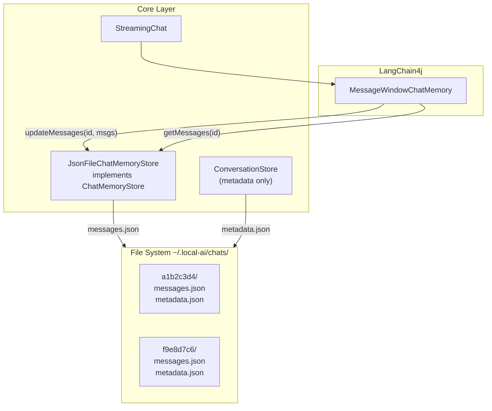
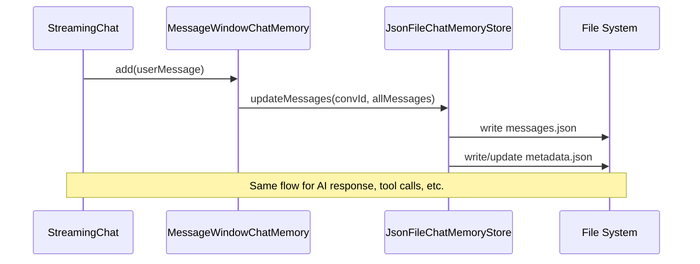

# Chat persistence in JSON files

## Architecture overview

LangChain4j's `ChatMemoryStore` interface is called automatically by `MessageWindowChatMemory` after every message addition. We implement it to persist messages to JSON files, eliminating the need for a custom auto-saver layer.




### File structure per conversation

```
~/.local-ai/chats/
  a1b2c3d4/
    messages.json      <-- LangChain4j ChatMessage list (serialized via ChatMessageSerializer)
    metadata.json      <-- our metadata (title, dates, forkedFrom)
  f9e8d7c6/
    messages.json
    metadata.json
```

Two files keep concerns separated:

- `messages.json` is owned by LangChain4j serialization (1:1 with LLM memory, faithful replay)
- `metadata.json` is our domain data (title, timestamps, fork info)

## Data model (core module)

### `ConversationMetadata` record in [core/.../storage/conversations/ConversationMetadata.java](core/src/main/java/dev/local/ai/core/storage/conversations/ConversationMetadata.java)

```java
@JsonIgnoreProperties(ignoreUnknown = true)
public record ConversationMetadata(
    String id,
    String title,
    Instant createdAt,
    Instant updatedAt,
    ForkInfo forkedFrom       // nullable, for future fork support
) {}
```

- `forkedFrom` included now (nullable) to avoid future schema migration
- `title` generated from first 60 chars of first user message

### `ForkInfo` record

```java
public record ForkInfo(String conversationId, int atMessageIndex) {}
```

### `ConversationSummary` record

```java
public record ConversationSummary(String id, String title, Instant createdAt, Instant updatedAt) {}
```

- Lightweight listing object derived from `ConversationMetadata`

## ChatMemoryStore implementation (core module)

### `JsonFileChatMemoryStore` in [core/.../storage/conversations/JsonFileChatMemoryStore.java](core/src/main/java/dev/local/ai/core/storage/conversations/JsonFileChatMemoryStore.java)

Implements `dev.langchain4j.store.memory.chat.ChatMemoryStore`:

- `**getMessages(Object memoryId)**`: read `chats/{memoryId}/messages.json`, deserialize using `ChatMessageDeserializer.messagesFromJson()`; return empty list if file doesn't exist
- `**updateMessages(Object memoryId, List<ChatMessage> messages)**`: serialize using `ChatMessageSerializer.messagesToJson()`, write to `chats/{memoryId}/messages.json`, create directory if needed. Also update `metadata.json` updatedAt timestamp (and create metadata with auto-generated title on first write)
- `**deleteMessages(Object memoryId)**`: delete `chats/{memoryId}/` directory

Key points:

- Uses LangChain4j's built-in `ChatMessageSerializer` / `ChatMessageDeserializer` for message JSON
- `MessageWindowChatMemory` calls `updateMessages` automatically after every `chatMemory.add()` -- no manual save logic needed
- Title auto-generated from first `UserMessage` content (first 60 chars)

### How auto-save works (no custom code needed)




## Metadata store (core module)

### `ConversationStore` in [core/.../storage/conversations/ConversationStore.java](core/src/main/java/dev/local/ai/core/storage/conversations/ConversationStore.java)

Manages conversation metadata (not messages). Responsibilities:

- `List<ConversationSummary> listConversations()` -- scan `chats/` subdirectories, read `metadata.json` from each, cache in memory, return sorted by `updatedAt` desc
- `Optional<ConversationSummary> getLastConversation()` -- most recently updated from cache
- `void deleteConversation(String id)` -- delete directory `chats/{id}/`, remove from cache
- `String createConversation()` -- create new directory with UUID, initial empty metadata, return ID
- `void refreshCache()` -- rescan directories (e.g. after external changes)

In-memory cache: `Map<String, ConversationSummary>` populated on construction.

Note: `JsonFileChatMemoryStore.updateMessages()` also updates metadata.json (updatedAt, title on first message), so `ConversationStore` needs to be notified or re-read metadata after saves. Simplest approach: `JsonFileChatMemoryStore` holds a reference to `ConversationStore` and calls `refreshSummary(id)` after writing metadata.

## Refactoring StreamingChat (core module)

### Changes to [core/.../chat/streaming/StreamingChat.java](core/src/main/java/dev/local/ai/core/chat/streaming/StreamingChat.java)

`ChatMemory` becomes a constructor parameter instead of being created internally:

```java
public StreamingChat(StreamingChatModel chatModel,
                     ChatMemory chatMemory,         // <-- injected
                     IToolProvider toolProvider,
                     CoreEventBus eventBus,
                     StreamingChatModelsProvider chatModelsProvider)
```

Remove the internal `MessageWindowChatMemory.builder()...build()` call from constructor.

This enables the caller (`ControllerFactory`) to build `ChatMemory` with the file-backed `ChatMemoryStore`, and also to set the `memoryId` to the conversation ID.

Same change for [core/.../chat/Chat.java](core/src/main/java/dev/local/ai/core/chat/Chat.java) if needed.

## Wiring (UI module)

### Changes to [ui/.../context/AppContext.java](ui/src/main/java/dev/local/ai/context/AppContext.java)

- Add `ConversationStore conversationStore` field
- Add `JsonFileChatMemoryStore chatMemoryStore` field
- Both instantiated in constructor with base path `~/.local-ai/chats/`

### Changes to [ui/.../context/ControllerFactory.java](ui/src/main/java/dev/local/ai/context/ControllerFactory.java)

Building `ChatController`:

1. Determine conversation ID: `conversationStore.getLastConversation().map(id)` or `conversationStore.createConversation()` for new
2. Build `ChatMemory`:

```java
   MessageWindowChatMemory.builder()
       .id(conversationId)
       .chatMemoryStore(chatMemoryStore)
       .maxMessages(1000)
       .build()
   

```

1. Build `StreamingChat(streamingModel, chatMemory, toolProvider, eventBus, modelsProvider)`
2. Build `ChatViewModel(chat, ...)` -- existing callback chain unchanged

### Startup flow

```
AppContext created
  -> ConversationStore scans chats/ (builds in-memory summaries)
  -> JsonFileChatMemoryStore created (same base directory)

ControllerFactory.call(ChatController.class)
  -> get last conversation ID from ConversationStore (or create new)
  -> build ChatMemory with chatMemoryStore and conversation ID
     -> MessageWindowChatMemory calls getMessages(conversationId)
     -> messages.json loaded automatically into memory
  -> build StreamingChat with injected ChatMemory
  -> build ChatViewModel
  -> chat.setCallback(chatViewModel) -- existing flow, no AutoSaver needed
  -> populate ChatViewModel.chatMessages from chatMemory.messages() for UI display
```

Key insight: `MessageWindowChatMemory` automatically loads messages from `ChatMemoryStore.getMessages()` on construction. The last conversation's messages are available immediately.

## Tests

- `**JsonFileChatMemoryStoreTest**` -- test `getMessages`, `updateMessages`, `deleteMessages` with `@TempDir`; verify messages.json and metadata.json are created/updated; verify title auto-generation from first UserMessage
- `**ConversationStoreTest**` -- test `listConversations`, `createConversation`, `deleteConversation`, `getLastConversation` with `@TempDir`
- Both using JUnit 5, Mockito BDD style where appropriate, `@Captor` for argument capture

## Out of scope (future)

- Media/attachments in conversations (file storage in conversation directory)
  - maybe we should use multiple message contents for text
- Fork conversation
- Conversation list UI dialog
- Conversation search
- File locking for multiple windows
- Statistics persistence (not part of LangChain4j ChatMessage -- can be added to metadata.json later)

